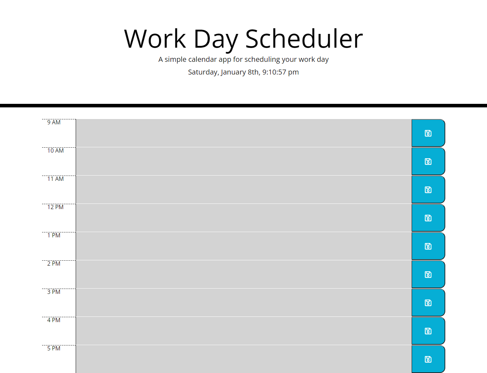

<h1>Challenge 5: Work Day Scheduler <h2>
 
 <h2>Site URL:</h2>
 https://nickus1028.github.io/plan-your-day/
 
 <h2>Screenshot<h2>
 </img>
   
 <h2>Summary</h2>
   
  <ul>
    <li>Using third party APIs (JQuery, JQuery UI, Moment.js and Boostrap) created a Work Day Scheduler</li>
    <li>Used an array to store variables and data</li>
    <li>Dynamically created HTML elements using that array</li>
    <li>Stored values into local storage</li>
    <li>Pulled data from local storage and displayed values on to the page</li>
   </ul>

